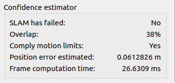

# lidar_slam

- [lidar\_slam](#lidar_slam)
  - [LiDAR SLAM node](#lidar-slam-node)
    - [Description and basic usage](#description-and-basic-usage)
    - [More advanced usage](#more-advanced-usage)
      - [Detailed pipeline](#detailed-pipeline)
      - [Online configuration](#online-configuration)
        - [Reset state](#reset-state)
        - [Map update modes](#map-update-modes)
        - [Save maps](#save-maps)
        - [Set pose](#set-pose)
        - [Switch ON/OFF the process](#switch-onoff-the-process)
      - [Failure detection](#failure-detection)
  - [Optional external sensors use](#optional-external-sensors-use)
    - [Optional GPS use](#optional-gps-use)
      - [Map (GPS) / Odom (SLAM) calibration](#map-gps--odom-slam-calibration)
      - [SLAM pose graph optimization (PGO) with GPS prior](#slam-pose-graph-optimization-pgo-with-gps-prior)
      - [Running SLAM on same zone at different times (e.g. refining/aggregating map or running localization only on fixed map)](#running-slam-on-same-zone-at-different-times-eg-refiningaggregating-map-or-running-localization-only-on-fixed-map)
        - [Setting SLAM pose from GPS pose guess](#setting-slam-pose-from-gps-pose-guess)
        - [Running SLAM on same zone](#running-slam-on-same-zone)
    - [Optional landmarks use](#optional-landmarks-use)
      - [Local optimization](#local-optimization)
      - [Pose graph optimization](#pose-graph-optimization)
    - [Optional Camera use](#optional-camera-use)
  - [About the published TF tree](#about-the-published-tf-tree)
- [Points aggregation](#points-aggregation)

Wrapping for Kitware LiDAR-only SLAM. It can also use GPS data to publish SLAM output pose as GPS coordinates, or to correct SLAM trajectory and map.

## LiDAR SLAM node

### Description and basic usage

The SLAM node subscribes to one or several topics of LiDAR pointclouds, and computes current pose of the tracked frame relative to the fixed odometry frame. It can output various data, such as SLAM pose (as Odometry msg or TF), keypoint maps, etc.

SLAM node supports massive configuration from ROS parameter server (even if default values are already provided). Examples of yaml configuration files can be found in [`params/`](params/). All parameters have to be set as private parameters.

To start only raw LiDAR SLAM, just start *lidar_slam_node*:
```bash
rosrun lidar_slam lidar_slam_node
```
If you want to specify parameters, you should consider using a launchfile. Two launch files are provided in the folder [`launch/`](launch/).

With velodyne launch file:
- To start SLAM when replaying a velodyne rosbag file, run :
```bash
roslaunch lidar_slam slam_velodyne.launch   # in 1st shell
rosbag play --clock <my_bag_file>  # in 2nd shell
```
- When using it in real live conditions, use :
```bash
roslaunch lidar_slam slam_velodyne.launch use_sim_time:=false
```

With ouster launch file:
- To start SLAM when replaying a ouster rosbag file, run :
```bash
roslaunch lidar_slam slam_ouster.launch   # in 1st shell
rosbag play --clock <my_bag_file>  # in 2nd shell
```
- When using it in real live conditions, use :
```bash
roslaunch lidar_slam slam_ouster.launch replay:=false
```

These launch files will start :

* the *lidar_slam_node* which implements the SLAM process,
* a pre-configured RViz session,
* the *lidar_conversion_node* which converts the driver point type to expected SLAM use (see next paragraph),
* (optional) The Lidar drivers if required (see vlp16_driver and os_driver parameters),
* (optional) GPS/UTM conversions nodes to publish SLAM pose as a GPS coordinate in WGS84 format (if `gps` arg is enabled). This uses the prior that full GPS pose and GPS/LiDAR calibration are correctly known and set (see [GPS/SLAM calibration](#gpsslam-calibration) section below for more info).


### More advanced usage

#### Detailed pipeline

The SLAM node subscribes to one or several input pointclouds topics ((default single topic is *lidar_points*) as *sensor_msgs/PointCloud2* messages. These pointclouds should have the following fields:
- **x**, **y**, **z** (`float`) : point coordinates
- **time** (`double`) : time offset to add to the pointcloud header timestamp to get approximate point-wise acquisition timestamp
- **intensity** (`float`) : intensity/reflectivity of the point
- **laser_id** (`uint16`) : numeric identifier of the laser ring that shot this point. The lowest/bottom laser ring should be 0, and it should increase upward.
- **device_id** (`uint8`) : numeric identifier of the LiDAR device/sensor. This id should be the same for all points of the cloud acquired by the same sensor.
- **label** (`uint8`) : optional input, not yet used.

If your LiDAR driver does not output such data, you can use the `lidar_conversions` nodes.

Optional input GPS (see [Optional GPS use](#optional-gps-use) section) fix must be a *gps_common/GPSFix* message published on topic '*gps_fix*'.

SLAM outputs can also be configured out to publish :
- current pose as an *nav_msgs/Odometry* message on topic '*slam_odom*' and/or a TF from '*odometry_frame*' to '*tracking_frame*';
- extracted keypoints from current frame as *sensor_msgs/PointCloud2* on topics '*keypoints/{edges,planes,blobs}*';
- keypoints maps as *sensor_msgs/PointCloud2* on topics '*maps/{edges,planes,blobs}*';
- Current target keypoints maps (i.e submaps) as *sensor_msgs/PointCloud2* on topics '*submaps/{edges,planes,blobs}*';
- registered and undistorted point cloud from current frame, in odometry frame, as *sensor_msgs/PointCloud2* on topic '*slam_registered_points*';
- confidence estimations on pose output, as *lidar_slam/Confidence* custom message on topic '*slam_confidence*'. It contains the pose covariance, an overlap estimation, the number of matched keypoints, a binary estimator to check motion limitations and the computation time.

UTM/GPS conversion node can output SLAM pose as a *gps_common/GPSFix* message on topic '*slam_fix*'.

**NOTE** : It is possible to track any *tracking_frame* in *odometry_frame*, using a pointcloud expressed in an *lidar_frame*. However, please ensure that a valid TF tree is beeing published to link *lidar_frame* to *tracking_frame*.

#### Online configuration

Some features are available online. Note that an interface for some of these features is available in the rviz visualization plugin.


##### Reset state
At any time, the SLAM state can be reset meaning the maps, the trajectory and the external sensors are cleaned and all the metrics are reset as for the first frame acquisition. Note that it disables the recovery mode as well.
##### Map update modes

At any time, commands `lidar_slam/SlamCommand/DISABLE_SLAM_MAP_UPDATE`, `lidar_slam/SlamCommand/ENABLE_SLAM_MAP_EXPANSION` and `lidar_slam/SlamCommand/ENABLE_SLAM_MAP_UPDATE` can be published to '*slam_command*' topic to change SLAM map update mode.
- `DISABLE_SLAM_MAP_UPDATE` : when an initial map is loaded, it is kept untouched through the SLAM process.
- `ENABLE_SLAM_MAP_EXPANSION` : when an initial map is loaded, its points are remained untouched but new points can be added if they lay in an unexplored area
- `ENABLE_SLAM_MAP_UPDATE` : the map is updated at any time

_NOTE_ : if no initial map is loaded, ENABLE_SLAM_MAP_EXPANSION and ENABLE_SLAM_MAP_UPDATE will have the same effect.

Example :
```bash
rostopic pub -1 /slam_command lidar_slam/SlamCommand "command: 9"
```

##### Save maps

The current maps can be saved as PCD at any time publishing the command `SAVE_KEYPOINTS_MAPS` (to save the whole maps) or the command `SAVE_FILTERED_KEYPOINTS_MAPS` (to remove the potential moving objects) to `slam_command` topic:

```bash
rostopic pub -1 /slam_command lidar_slam/SlamCommand "{command: 16, string_arg: /path/to/maps/prefix}"
```
OR
```bash
rostopic pub -1 /slam_command lidar_slam/SlamCommand "{command: 17, string_arg: /path/to/maps_filtered/prefix}"
```

##### Set pose
At any time, a pose message (`PoseWithCovarianceStamped`) can be sent through the topic `set_slam_pose` to reset the current pose

##### Switch ON/OFF the process
At any time, the SLAM can be switched ON/OFF using the command message :
```bash
rostopic pub -1 /slam_command lidar_slam/SlamCommand "command: 14"
```
This disables the sensor messages handling of the node.

#### Failure detection

Some metrics are available to evaluate the SLAM output. They include:
* Overlap estimation of the current frame on the map. A gap of overlap between successive frames can be suspicious
* The compliance of motion limits. The thresholds must be set by the user depending of the acquisition setup
* The number of keypoints matched. A weak number of matches can be suspicious.
* The standard deviation of the position error. This is derived from the covariance of the optimization output. It can be useful to detect a lack of degree of liberty. Warning, it is not robust to failure cases

These metrics can be visualized on RVIZ using the visualization plugin.



Another feature has been developped to fuse the confidence estimators to trigger a failure. The failure cases that can be detected include :
- Map doubling, due to an isolated high motion, a temporal big occlusion or to quick scene change (e.g. door crossing)
- Lack of degree of liberty (e.g. corridor case)
- Divergence due to a combination of external factors

To enable this feature, you should turn on *failure_detector/enable* in the SLAM parameters.

In case a failure is detected, the filter enters a recovery mode. This mode fixes the map and the trajectory to an older state and automatically updates some of the parameters to allow a bigger motion and a longer computation time. The user should go back to a previous pose to try to be relocalized and get out of this mode to go on with his acquisition without breaking the map. He can also update the parameters for the specific trajectory section that has gone wrong.

**/!\ Warning** : for now, going back to a previous pose includes orientation, so, mind your acquisition direction when looking for recovery.

If this feature is disabled during recovery, the state is reset as before the recovery mode has been triggered. Therefore, if you see the SLAM is relocalized but the recovery mode is still on (the confidence thresholds have not been reached), you can disable the failure detection and reenable it later on to force going out of the recovery mode.

**/!\ Warning** : in recovery mode, some of the parameters are modified. Namely, the *map update mode*, the *ego-motion mode*, the *undistortion mode*, the *maximum number of ICP iterations*, the *maximum distance between nearest neighbors* and the *initial saturation distance* are set to recovery values.
 If you change these parameters during the recovery mode, they will be reset as **before** the recovery mode after relocalization.

## Optional external sensors use

A GPS, a camera and/or a tag detector can be used along with the LiDAR SLAM. Wheel odometer, IMU and pose detector API are available in the slam_lib but their ROS interface has not been implemented for now.

Some external sensors can be used locally (in the local SLAM optimization) or globally (in a pose graph).
cameras, wheel odometers, IMU are usually used in the first case while GPS, as absolute poses sensor, is usually used in the second case. A tag detector can be used in both cases.

To use them, a time synchronization must be possible. To do so, a parameter *lidar_is_posix* allows to synchronize using packet reception time (false) or lidar header time information (true).

Moreover, the data should be stored, at least until the best time fit is found for lidar frame in case of local optimization and to select from when to update the trajectory along with the maps in case of pose graph optimization.

Weights are parameterizable in case of local optimization to calibrate the impact of the sensor relatively to 3D matches built with lidar frames. This weight depends mostly on the sensors accuracy.

Logging must be enabled in case of pose graph optimization.


### Optional GPS use

If GPS use is enabled, *LidarSlamNode* subscribes to the GPS odometry on topic '*gps_odom*', and records the most recent GPS positions. To use GPS data, we transform GPS WGS84 fix into cartesian space using UTM projection. This can be used to estimate calibration between GPS and SLAM trajectories, or post-optimize SLAM trajectory with pose graph optimization (PGO).

To use GPS data :
- enable gps use : `external_sensors/gps/use_gps = true`:
- enable logging of previous poses, covariances and keypoints : `slam/logging_timeout != 0`

**NOTE** : If GPS odometry expresses the pose of a *gps_frame* different from *tracking_frame*, please ensure a valid static TF is beeing broadcasted.

#### Map (GPS) / Odom (SLAM) calibration

To be able to publish local SLAM odometry as GPS coordinates, it is necessary to link local SLAM odometry frame (often called `odom`) to world fixed frame (often called `map`).

If GPS use is enabled, *LidarSlamNode* can try to estimate the transform that links these frames by aligning SLAM and GPS trajectories with rigid ICP matching. The resulting transform is published as a static transform on TF server.

The calibration process can be triggered at any time by publishing the `lidar_slam/SlamCommand/GPS_SLAM_CALIBRATION` command to '*slam_command*' topic.

1. NOTE: During this auto-calibration process, GPS position and SLAM should be precise enough to guarantee a robust calibration.
2. NOTE: As registration is done via ICP without any other prior, the trajectories need to have some turns in order to fully constrain the problem. If the movement is only following a straight line, 1 rotation remains unconstrained, and could lead to serious artefacts.
3. NOTE: To fix this straight line case, a supplementary prior can be introduced, imposing for example the output calibration to have no roll angle (hypothesis of flat ground plane in front direction). However, if ground is not flat, it could also lead to bad calibration.
4. NOTE: Timestamps are currently not used for calibration, as GPS and SLAM clocks are not synchronized. It could be a nice future improvement.

To enable this GPS/SLAM auto-calibration, you can use option `gps:=true` :
```bash
roslaunch lidar_slam slam_velodyne.launch gps:=true  # Start SLAM node and enable GPS use.
...
rostopic pub -1 /slam_command lidar_slam/SlamCommand "command: 0"  # Trigger GPS/SLAM calibration
```

#### SLAM pose graph optimization (PGO) with GPS prior

Available GPS positions can also be used to optimize the SLAM trajectory by correcting drift error accumulated over time. The GPS positions and their associated covariances can be used as priors to optimize the SLAM pose graph with g2o framework. SLAM maps will also be corrected. The [map/odom calibration](#map-gps--odom-slam-calibration) will also be computed and published as a static TF (but should be more precise than the global ICP calibration process).

PGO can be triggered at any time by publishing the `lidar_slam/SlamCommand/GPS_SLAM_POSE_GRAPH_OPTIMIZATION` command to '*slam_command*' topic.

NOTE: This PGO is not real-time, and should therefore be run when system is not or slowly moving.

To enable PGO, you can use option `gps:=true` :
```bash
roslaunch lidar_slam slam_velodyne.launch gps:=true  # Start SLAM node and enable GPS use.
...
rostopic pub -1 /slam_command lidar_slam/SlamCommand "command: 20"  # Trigger PGO
```

#### Running SLAM on same zone at different times (e.g. refining/aggregating map or running localization only on fixed map)

##### Setting SLAM pose from GPS pose guess

If you want to run another bag on the same zone to refine the SLAM map or to run localization only with the previously built map, you need to give an approximate new init pose to SLAM if trajectory is not continuous with end pose. You can send `lidar_slam/SlamCommand/SET_SLAM_POSE_FROM_GPS` command to '*slam_command*' topic to use the last received GPS position in a pose guess for SLAM.

NOTE: To be able to use this command, SLAM and GPS coordinates must be precisely linked with a valid TF tree. Be sure you already called [pose graph optimization](#slam-pose-graph-optimization-pgo-with-gps-prior) or at least [map/odom calibration](#map-gps--odom-slam-calibration). Moreover, the orientation will be set as odometry frame.

##### Running SLAM on same zone

To sum up, if you want to run SLAM on same zone, use :
```bash
roslaunch lidar_slam slam_velodyne.launch gps:=true  # Start SLAM node and enable GPS use.
...  # Run 1st real test or bag file
rostopic pub -1 /slam_command lidar_slam/SlamCommand "command: 20"   # Trigger PGO : optimize SLAM map and compute GPS/SLAM calibration
(rostopic pub -1 /slam_command lidar_slam/SlamCommand "command: 8")  # Disable SLAM map update (optional)
rostopic pub -1 /slam_command lidar_slam/SlamCommand "command: 2"    # If the starting pose of the new bag does not match with last SLAM pose, use GPS position to set an initial guess. Warning, if the orientation has changed to much, SLAM may not converge.
...  # Run 2nd real test or bag file
```

### Optional landmarks use

#### Local optimization

If tags use is enabled, *LidarSlamNode* subscribes to the tag odometry on topic '*tag_detections*', and records the most recent tag relative poses.

One can use landmarks with a camera to detect them. The use conditions are the following :
1. The landmarks info must come under the shape of `apriltag_ros` messages.
2. The default reception topic is `tag_detections`.
3. The landmark detector (e.g. a camera) transform relatively to *tracking_frame* must be supplied as a `TF2 static transform`.
4. The parameter `use_tags` must be set to `true`.
5. Log enough tag measurements so an interpolation can be performed to synchronize them with the Lidar. `max_measures >= N`, with N being the number of the newest tag detections that must be stored so that when the SLAM needs a synchronized measure it finds two bounding measures in the N ones. It mostly depends on the memory capacity and the camera frequency.

***WARNING***: A virtual package of apriltag_ros exists in this wrapping for compilation issue and must be ignored if one wants to use the actual apriltag_ros package.

**NOTE** : You can specify the tag topic directly in the launch command with the argument : `tags_topic:="your_tag_topic"`.

Then, the lidar_slam node will receive the tag detection messages and a constraint will be built to be included in the local optimization together with the internal geometric constraints.

Various relative parameters are available :
1. `weight` : floating value to mitigate the tag impact on the optimization relatively to geometric matches.
2. `position_only=true` : only use the tags' positions and not the orientations provided by the detector. Orientation is usually less accurate.
3. `saturation_distance` : reject the measurements that seem clearly wrong relatively to the geometric matches.
4. `publish_tags=true` : publish the tag as TF2 transform for visualization purposes mostly (parameter ).
5. `landmarks_file_path` : name of a file to load, to initially set absolute poses of the tags. The tag constraints are built relatively to these absolute reference poses and they will never be modified along iterations. If no file is loaded, the reference poses in the constraints are computed using previous detections and are refined along iterations or reset if the tag is not seen in a while. Note that if a file is loaded in mapping mode and some drift appears, it can lead to some jumps and a map distortion. The file format must be csv with one header line : *id,x,y,z,roll,pitch,yaw,cov0,[...],cov35*.

All these parameters are described in the supplied [config files](params).

***WARNING***: Remember to set max_measures, lidar_is_posix and time_threshold to convenient values to be able to use this feature.

***WARNING***: Make sure no error occured in the file loading step in the terminal output before supplying data.

#### Pose graph optimization

If the tags were activated, one can run a post optimization, using the tags to close loops and to create a consistent map. The previous recommandations for landmarks integration in local optimizations hold. Moreover, the LiDAR states logging must be enabled : `slam/logging_timeout > t`, t being the duration on which LiDAR measurements can be stored. The oldest measurements are forgotten. Only the remaining poses are used to build and optimize the graph and to rebuild the map.

If you want to run SLAM and then to optimize the graph using landmarks, one pipeline can be :
```bash
roslaunch lidar_slam slam_velodyne.launch tags_topic:="your_tag_topic" # Start SLAM (tags use must be enabled).
...  # Run 1st real test or bag file
...  # Stop the acquisition or pause the system
rostopic pub -1 /slam_command lidar_slam/SlamCommand "{command: 20, string_arg: path/to/landmarksAbsolutePoses.csv}"    # Trigger PGO : optimize SLAM map and update last pose (if fix_last is set to false)
rostopic pub -1 /slam_command lidar_slam/SlamCommand "{command: 16, string_arg: /path/to/maps/prefix}" # Save keypoint maps for further use
...  # Run 2nd real test or bag file
```

**NOTE** : After one pose graph optimization one should be able to proceed with the acquisition/replay.

**NOTE** : If the SLAM was running with initially loaded tag poses (`landmarks_file_path` is not empty), and one wants to run the pose graph optimization, the file parameter is not compulsory, one can just launch :
```bash
rostopic pub -1 /slam_command lidar_slam/SlamCommand "command: 20"
```
Again, running the SLAM in mapping mode with initially loaded tag poses can be dangerous though. If you don't have any absolute tag poses to supply, the last estimated tag poses will be used. It means the map will be updated so it fits the last frames.

### Optional Camera use

If camera use is enabled, *LidarSlamNode* subscribes to RGB images ([sensor_msgs::Image](http://docs.ros.org/en/noetic/api/sensor_msgs/html/msg/Image.html)) on topic '*camera_topic*', and records the most recent images. Note that this feature also needs a subscription to camera_info_topic containing the camera calibration ([sensor_msgs::CameraInfo](http://docs.ros.org/en/noetic/api/sensor_msgs/html/msg/CameraInfo.html)).

**NOTE** : You can specify the camera topics directly in the launch command with the argument : `camera_topic:="your_tag_topic"` and `camera_info_topic:="your_tag_topic"`.

**NOTE** : You can launch a decompression node contained in *ROS* default package **image_transport** directly in the launch command with the argument : `image_compressed:=true`

Images can then be used in local optimization if their timestamps are close enough to the Lidar frames' relatively to the threshold : *time_threshold*. To do so, first, the slam points are projected into the corresponding image. Then, an optical flow is computed on the extracted pixels and the image frame corresponding to next lidar frame (see [opencv documentation](https://docs.opencv.org/3.4/d4/dee/tutorial_optical_flow.html) for more details about optical flow computation). Finally, a constraint between pixels of the optical flow is built and added to slam optimization.

A weight is parameterizable for the new camera constraint. It represents the impact of one pixel match relatively to one geometric 3D point match (built from lidar frame) in the optimization. The more we trust the optical flow, the higher this weight should be. This parameter is described in the supplied [config files](params).

***WARNING***: Remember to set *max_measures*, *lidar_is_posix* and *time_threshold* to convenient values to be able to use this feature.

## About the published TF tree

Here is an example of the complete TF tree that can be maintained by different nodes as well as descriptions of each frame (default frame names) :

```bash
utm
└─ enu
   └─ map
      └─ odom
         └─ base_link
            ├─ lidar
            ├─ landmark_detector
            └─ gps
```

- **utm**: "world" ENU fixed frame, corresponding to the origin of the current considered UTM zone/band in which GPS coordinates are projected into.
- **enu**: local ENU fixed frame attached to 1st received GPS position in UTM coordinates, easier to use than **utm** because UTM coordinates can grow very large, leading to floating points discretization errors. The static TF `utm -> enu` is published by `gps_conversions/gps_to_utm` node.
- **map**: first received full 6D GPS pose. It defines the origin of the local map. If GPS does not provide orientation, pitch and heading can be estimated from motion. The static TF `enu -> map` is published by `gps_conversions/gps_to_utm` node.
- **odom**: origin of the SLAM. The TF `map -> odom` can be published by a custom node, by `lidar_slam/lidar_slam_node` node (in case of GPS/SLAM auto-calibration or PGO), or manually set with tf2 static publishers in [`launch/slam_velodyne.launch`](launch/slam_velodyne.launch) (in case of pre-defined calibration).
- **base_link**: current pose computed by SLAM algorithm (here `base_link` is the tracking frame). The TF `odom -> base_link` can be published by `lidar_slam/lidar_slam_node` node.
- **lidar**: pose of the LiDAR sensor on the moving base. The TF `base_link -> lidar` should be published by a `tf2_ros/static_transform_publisher` node.
- **landmark_detector**: pose of the landmark detector on the moving base. The TF `base_link -> landmark_detector` must be published by a `tf2_ros/static_transform_publisher` node.
- **gps**: pose of the GPS sensor on the moving base. The TF `base_link -> gps` should be published by a `tf2_ros/static_transform_publisher` node.

# Points aggregation

Another node called **aggregation_node** is included in the **lidar_slam** package and allows to aggregate all points from all frames into a unique pointcloud with a defined resolution : the points are stored in a voxel grid to supply a downsampled output cloud. It also allows to reject moving objects. The output pointcloud is published on the topic *aggregated_cloud*. It requires the output *registered_points* of the node **lidar_slam_node** to be enabled.

**aggregation_node** has 3 parameters :

- *leaf_size* : corresponds to the size of a voxel in meters in which to store one unique point. It is equivalent to the required mean distance between nearest neighbors. The maximum distance between nearest distance to downsample the cloud would be 2 * leaf_size
- *max_size* : corresponds to the maximum size of the voxel grid and so the maximum width of the output cloud to tackle possible memory issues.
- *min_points_per_voxel* : corresponds to the minimum number of frames which should have a point in a voxel to consider this voxel is not a moving object. It has been seen more than *min_points_per_voxel*, so it is considered "enough" to be a static object. All voxels that have been seen less than *min_points_per_voxel* times are not included to the output cloud.

This node can answer to a service called **save_pc** to save the pointcloud on disk as a PCD file. The command should be :

```bash
rosservice call lidar_slam/save_pc "prefix/path/where/to/save/the/cloud" 0
```

To save the pointcloud as a PCD ASCII file at *prefix/path/where/to/save/the/cloud_CurrentTime.pcd*.
All possible formats are :
- **ASCII** : 0
- **Binary** : 1
- **Binary compressed** : 2

**NOTE** : **aggregation_node** can be directly run from the launch files, adding the argument *aggregation:=true* to the launch command.